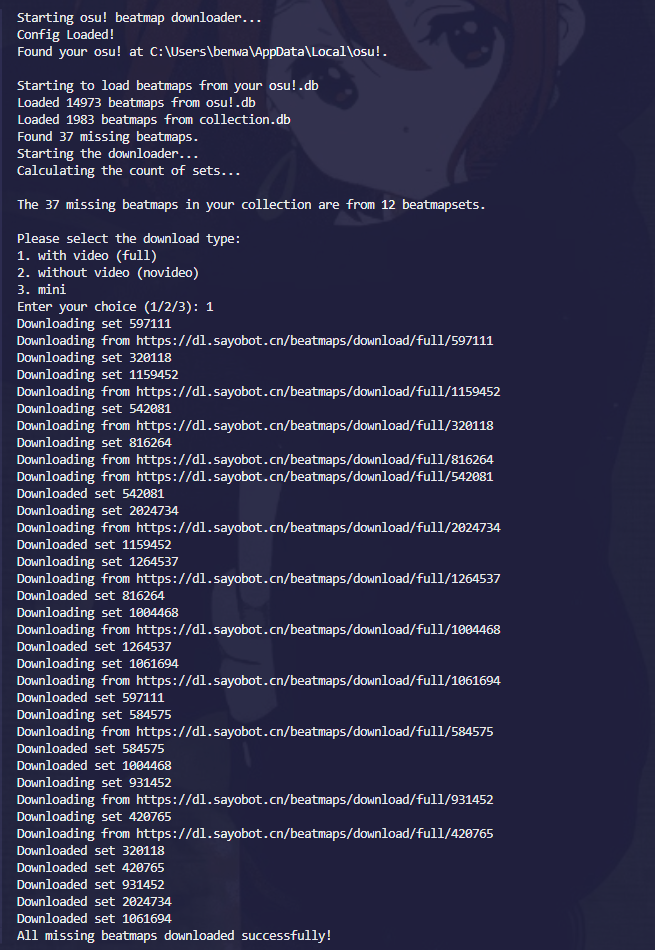

<!-- Markdownlint-disable MD033 -->

# OsuCollectionTab


An automated tool for downloading missing beatmaps from osu! collections, using Sayo as download source with multi-threaded support.

It compares your local beatmaps(by reading `osu!.db`) with the collections(by reading `collections.db`) you have, and downloads any missing ones.

> **Note**: Current version requires token configuration in either config.yaml (for Users) or config.go (for Developers maybe).

## 🌐 Index

- [English Version](#-features)
- [中文版本](#-功能特性)

---

## ✨ Features

- **Auto-detection** of osu! installation path and collections
- **Smart comparison** between local beatmaps and collection beatmaps
- **Multi-threaded downloads** with multi concurrency
- **Multiple download types**: Full/NoVideo/Mini versions
- **Mirror support** with automatic failover...? not yet
- **Progress visualization** with elegant progress shown

## 📦 Development

- **Go 1.20+**: Ensure you have Go 1.20 or later
- **Deps**: Install dependencies with `go mod tidy`
- **Build**: Compile with `go build -o osuCollectionTab.exe`
- **Dev**: Run with `go run main.go`

## 🚀 Usage

### Interactive Options



When executed, you'll be prompted to select download type:

```bash
Select download type:
1. With video (full)
2. No video (novideo)
3. Mini version (mini)
```

## ⚙️ Configuration

### Required Setup

1. Create `.config/config.yaml` in project root
2. Configure osu! paths:

```yaml
osu_path: "C:\\Users\\<YOUR_USERNAME>\\AppData\\Local\\osu!" # osu! install path
proxy: "http://127.0.0.1:7890" # Proxy for downloads
osu_api_token: "abcdefg" # Legacy osu! API token (long string)
```

## ❓ FAQ

**Q: How to get osu! API token?**
A: osu! website → Account Settings → OAuth → Legacy API → Create new application

## 📜 License

MIT License - See [LICENSE](LICENSE) for details

---

## ✨ 功能特性

- **自动检测** osu! 安装路径和收藏夹
- **智能比对** 本地已有谱面和收藏夹谱面
- **多线程下载** 支持多并发
- **多种下载类型** 可选带视频/无视频/精简版
- **镜像源支持** 暂未实现断点续传
- **进度显示** 使用美观的（并不）进度反馈

## 📦 开发

- **Go 1.20+**: 确保 Go 版本 ≥ 1.20
- **依赖**: 使用 `go mod tidy` 安装
- **编译**: `go build -o osuCollectionTab.exe`
- **运行**: `go run main.go`

## 🚀 使用说明

### 交互选项

运行时将提示选择下载类型：

```bash
请选择下载类型:
1. 带视频 (full)
2. 无视频 (novideo)
3. 精简版 (mini)
```

## ⚙️ 配置

### 必要配置

1. 在项目根目录创建 `.config/config.yaml`
2. 配置 osu! 路径：

```yaml
osu_path: "C:\\Users\\<用户名>\\AppData\\Local\\osu!" # osu!安装路径
proxy: "http://127.0.0.1:7890" # 下载代理
osu_api_token: "abcdefg" # 旧版osu! API令牌
```

## ❓ 常见问题

**Q: 如何获取 osu! API 令牌?**
A: osu!官网 → 账户设置 → OAuth → 旧版 API → 创建应用

## 📜 许可证

MIT 许可证 - 详见 [LICENSE](LICENSE)

---

> 🐞 发现问题？欢迎提交 Issue 或 Pull Request
